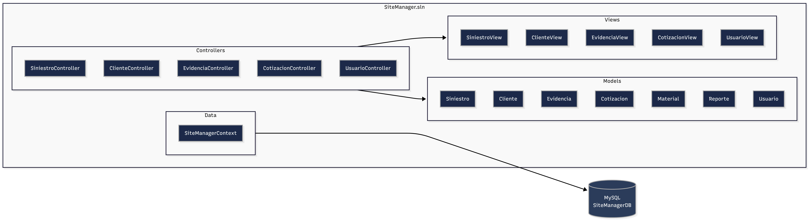
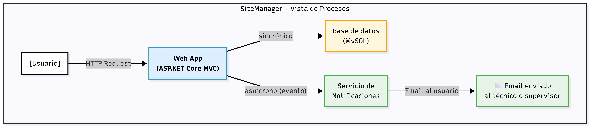
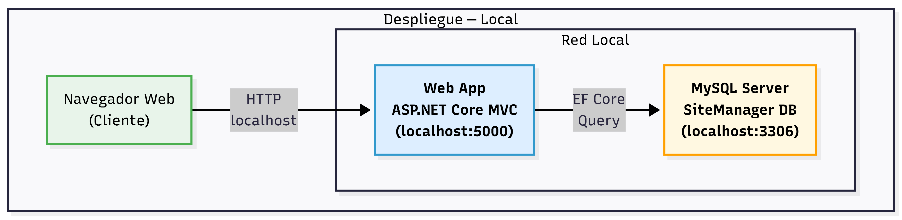

# ADR-02: SiteManager - Implementación de Vistas Arquitectónicas 

| Campo  | Valor |
|--------|-------|
| Autor  | Àngela Rojas |
| Fecha  | 05/06/2026 |
| Estado | `APROBADO` |

---

## Contexto

Este proyecto en el desarrollo de una app de gestión de siniestros y levantamientos de obra, por ahora llamada "SiteManager", es una plataforma que tiene como meta facilitar y digitalizar el proceso de registro, seguimiento y administración de levantamientos de daños y reparaciones. Actualmente, este tipo de trabajo se gestiona de forma manual mediante hojas físicas, lo que genera pérdida de información, dificultad para consultar antecedentes de cada caso, desorganización en el manejo de evidencias fotográficas, planos, materiales y presupuestos. Como tal la app busca resolver esto juntando toda la información en una sola plataforma accesible y estructurada.

Está idea va dirigida a profesionales y trabajadores que realizan supervisión de reparaciones: arquitectos, ingenieros, técnicos de mantenimiento y supervisores de obra.

- En cuanto a las condiciones que influyeron en las decisiones de esta idea de proyecto: se tiene experiencia previa en Java, sin embargo, dado que ahora mismo en la materia está trabajando con ASP.NET y C#, se decidió adoptar estas tecnologìas como una oportunidad para expandir el uso de herramientase y mantener una combinacion con los futuros temas que se veran en clase. 
- Para la base de datos se eligió MySQL por su facilidad de configuración en entorno local y porque es mas apta para proyectos de baja magnitud, siendo compatible con Entity Framework Core. 

---

## Decisión

Para empezar escogi la arquitectura de software **Model-View-Controller (MVC)** como patrón estructural principal del sistema. Este patrón separa claramente las responsabilidades: el **Model** representa las entidades del dominio (Siniestro, Cliente, Evidencia, Cotización), el **Controller** maneja la lógica de negocio, y la **View** es solo la parte en la que el cliente o usuario interactua.

**¿Por qué?** El proyecto maneja entidades con relaciones entre sí y procesos (un siniestro pasa por distintas etapas desde el levantamiento hasta el cierre). MVC permite organizar este proceso de forma clara, asignando a cada capa una responsabilidad específica. Esto facilita el mantenimiento y la escalabilidad del proyecto.

---

### ASP.NET Core y C#

Se eligió ASP.NET Core como framework principal del backend por su soporte nativo al patrón MVC.

**¿Por qué?** ASP.NET Core implementa MVC de forma nativa, lo que reduce la configuración manual y permite enfocarse en la lógica del negocio. 

---

### Base de datos: MySQL

Se eligió MySQL como motor de base de datos relacional.

**¿Por qué?** Es una base de datos relacional que permite organizar bien la información del sistema. Es ideal ya que las entidades están relacionadas entre sí (por ejemplo, clientes, siniestros y evidencias), y MySQL ayuda a mantener esa relación de forma ordenada y consistente. También es fácil de usar, instalar y tiene mucha documentación, lo que la hace adecuada para un proyecto pequeño.

---

### Entity Framework

Se usará Entity Framework Core para conectar las clases de C# con la base de datos MySQL.

**¿Por qué?** Permite trabajar las tablas como si fueran clases en el código, lo que hace más fácil mantener todo organizado y consistente. Además, permite hacer cambios en la base de datos de forma controlada mediante migraciones, sin tener que modificarla manualmente cada vez.

---

### Alternativas consideradas

| Alternativa | Por qué la descarté |
|-------------|---------------------|
|  **Java + Spring Boot**  | Se descartó porque requiere más configuración inicial. Como ahora se usa solo C# y ASP.NET Core en la materia, tiene más sentido trabajar con estas tecnologìas ya que asi el profesor podria brindarme alguna ayuda si la requiero. |
|  **PostgreSQL (Base de datos)**  | Aunque es más potente, su configuración es más compleja. MySQL es más sencillo de usar para un proyecto individual. |
| **Arquitectura de Microservicios** | Es una arquitectura más compleja que no es necesaria para un proyecto pequeño, ademas considerando las otras herramientas que aun quiero dominar me resultaria tedioso. MVC es mas que suficiente. |

---

## Consecuencias

**✅ Lo que gano:**

- **Técnico:** La adopción de MVC con ASP.NET Core me va a permitir una separación clara de responsabilidades desde el inicio. Agregar nuevas entidades al sistema (por ejemplo, una secciòn de registro de pagos o proveedores) implica únicamente crear una nueva clase C#, sin afectar el resto del sistema. Esto hace que el proyecto sea mantenible y mas que nada escalable.

- **Proceso:** Al trabajar sola, Al usar un mismo ecosistema (ASP.NET Core + Entity Framework Core), se reduce la complejidad y el tiempo de configuración. Esto me permite enfocarme más en la lógica del sistema en lugar de en la configuración.

**⚠️ Lo que sacrifico o asumo:**

- **Limitación técnica:** Al usar una arquitectura MVC, todo el backend está en un solo sistema. Si en el futuro se necesita dividirlo en partes más independientes (microservicios), sería necesario hacer cambios grandes.

- **Deuda o riesgo:** Al usar MySQL, se asume que será suficiente para las necesidades del proyecto durante el cuatrimestre. Sin embargo, si el sistema creciera y necesitara manejar más datos o funciones más avanzadas, podría ser necesario cambiar a una base de datos más robusta como PostgreSQL. Hacer este cambio más adelante implicaría modificar migraciones, revisar compatibilidades y ajustar consultas, lo que podría tomar bastante tiempo y esfuerzo.

---

## Diagrama

Un boceto de cómo se estructura tu sistema (draw.io, Mermaid o a mano escaneado)

---

## Vistas Arquitectónicas

---

**Vista Lógica**

La vista lógica describe los módulos funcionales que componen SiteManager y las responsabilidades de cada uno. El sistema está organizado siguiendo el patrón MVC, donde cada módulo tiene una capa de vista, un controlador y una entidad de modelo correspondiente.

**Módulos funcionales del sistema:**

| Módulo | Responsabilidad |
|---|---|
| **Gestión de Siniestros** | Registrar, actualizar y dar seguimiento a cada caso desde el levantamiento inicial hasta el cierre |
| **Gestión de Clientes** | Administrar la información de los clientes asociados a cada siniestro |
| **Gestión de Evidencias** | Registrar y organizar las fotografías y documentos de respaldo de cada caso |
| **Gestión de Cotizaciones** | Crear y consultar los presupuestos y materiales asociados a cada siniestro |
| **Gestión de Usuarios** | Controlar el acceso al sistema y los permisos según el rol de cada usuario |

Cada módulo se compone de tres elementos dentro de la arquitectura MVC: una vista en Razor Pages que presenta la información al usuario, un controlador en ASP.NET Core que maneja la lógica de negocio, y una entidad de modelo gestionada por Entity Framework Core que representa los datos en la base de datos MySQL.

---

## Vista de Desarrollo

---

La vista de desarrollo muestra cómo está organizado el código del proyecto por dentro. SiteManager sigue la estructura estándar de ASP.NET Core con MVC, donde cada carpeta tiene una responsabilidad clara y separada.

-Controllers/ — Aquí viven los controladores de cada módulo. Cada archivo recibe las peticiones del usuario, aplica la lógica de negocio y decide qué datos mostrar y en qué vista.

-Models/ — Aquí están las clases C# que representan las entidades del sistema. Cada clase se convierte en una tabla dentro de la base de datos MySQL a través de Entity Framework Core.

-Views/ — Aquí están las vistas Razor organizadas por módulo. Cada subcarpeta contiene los archivos de interfaz correspondientes a su controlador; por ejemplo, la carpeta Siniestro contiene las páginas para crear, editar, listar y ver el detalle de un siniestro.

-Data/ — Aquí vive el contexto de Entity Framework Core (SiteManagerContext), que es la clase que conecta el proyecto con la base de datos MySQL y registra todas las entidades que se van a persistir.

---

## Vista de Procesos

--- 

La vista de procesos muestra el flujo que sigue una operación importante dentro del sistema. En SiteManager, el proceso más relevante es el **registro de un siniestro nuevo**, ya que es el punto de entrada de toda la información que el sistema gestiona.

1. Petición: El usuario registra un siniestro desde el navegador, enviando una petición HTTP al sistema.
2. Procesamiento Sincrónico: ASP.NET Core MVC recibe los datos. El controlador los valida y le ordena al modelo guardarlos. El sistema espera la confirmación antes de continuar.
3. Persistencia: Entity Framework Core guarda el registro en la base de datos MySQL de forma segura.
4. Evento Asíncrono: Con el registro confirmado, la aplicación web avisa al Servicio de Notificaciones. Al ser asíncrono, la web no se bloquea esperando que el correo se envíe; el usuario ya recibió su respuesta.
5. Envío: El Servicio de Notificaciones procesa la cola en segundo plano y envía el correo electrónico al técnico asignado.

---

## Vista de Despliegue

---

La vista de despliegue describe dónde y cómo se planea ejecutar el sistema. Dado que SiteManager se encuentra actualmente en fase de desarrollo, el despliegue planeado para esta etapa es en entorno local, utilizando la máquina de desarrollo como servidor.

Por ahora SiteManager corre en la computadora local. El usuario abre un navegador, entra a localhost y el sistema responde desde ahí. La aplicación y la base de datos MySQL viven en la misma máquina y se comunican entre sí.

---

## Cláusula de IA 

Se utilizó inteligencia artificial como herramienta de apoyo en las siguientes tareas:

- Generación de los códigos Mermaid para los diagramas de cada vista arquitectónica (lógica, desarrollo, procesos y despliegue)
- Estructuración del ADR-02 siguiendo el formato establecido.
- Sugerencias sobre qué incluir en cada vista con base en el proyecto SiteManager.

