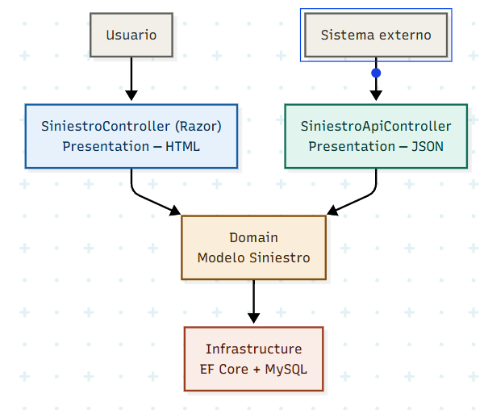

# ADR-04: SiteManager — Incorporación de API REST

| Campo  | Valor |
|--------|-------|
| Autor  | Ángela Rojas |
| Fecha  | 19/06/2026 |
| Estado | `Propuesto` |

---

## Contexto

SiteManager es una aplicación web que busca digitalizar la gestión de siniestros, levantamientos y reparaciones de obra. El sistema maneja varias entidades que se relacionan entre sí, como Siniestro, Cliente, Evidencia y Cotización, además de flujos de trabajo definidos que van desde el registro de un caso hasta su cierre.

Al ser un proyecto individual con un tiempo limitado a la duración del cuatrimestre, se necesita un estilo arquitectónico que sea claro, fácil de mantener por una sola persona y que sea compatible con las tecnologías ya elegidas: ASP.NET Core, Razor Pages, Entity Framework Core y MySQL.

SiteManager actualmente expone toda su funcionalidad a través de Razor Pages, donde el usuario interactúa directamente desde el navegador con formularios y vistas HTML. Esto funciona bien para los usuarios internos del sistema, como técnicos, supervisores y arquitectos, pero limita la posibilidad de que otros sistemas externos puedan consultar o enviar información a SiteManager sin pasar por una pantalla.

Conforme el proyecto avanza, surge la necesidad de exponer la información de forma más estructurada y accesible, de manera que otros sistemas puedan comunicarse con SiteManager directamente. Para esto se requiere incorporar una forma de intercambiar datos en un formato estándar, sin depender únicamente de las páginas web ya existentes.

---

## Decisión

Se decidió incorporar una **API REST** a SiteManager, implementada con **ASP.NET Core Web API**, comenzando con el módulo de **Siniestros**. La API expone las operaciones básicas de Crear, Leer, Actualizar y Eliminar (CRUD) mediante los siguientes endpoints:

| Método HTTP | Ruta | Función |
|---|---|---|
| `GET` | `/api/siniestros` | Obtener todos los siniestros |
| `GET` | `/api/siniestros/{id}` | Obtener un siniestro específico por ID |
| `POST` | `/api/siniestros` | Crear un nuevo siniestro |
| `PUT` | `/api/siniestros/{id}` | Actualizar un siniestro existente |
| `DELETE` | `/api/siniestros/{id}` | Eliminar un siniestro |

La API convive con las Razor Pages ya existentes dentro del mismo proyecto. Razor Pages sigue siendo la forma en que el usuario interactúa visualmente con el sistema, mientras que la API REST es una puerta adicional que entrega y recibe datos en formato JSON, pensada para sistemas externos. La documentación de los endpoints se hace mediante **Swagger**, que es el estándar de la industria para documentar APIs.

**¿Por qué REST?** REST es un estilo ampliamente adoptado en la industria porque utiliza el protocolo HTTP de forma estándar: cada método (GET, POST, PUT, DELETE) tiene un significado claro y predecible. Esto facilita que cualquier desarrollador externo entienda cómo consumir la API sin necesidad de documentación extensa adicional. Además, REST es compatible de forma natural con ASP.NET Core Web API, lo que evita agregar dependencias o tecnologías externas al proyecto.

---

**Detalle de cada endpoint:**

- **`GET /api/siniestros`** — Devuelve la lista completa de siniestros registrados en el sistema, incluyendo sus datos principales como cliente, tipo de daño y estado actual. Útil para que un sistema externo consulte todos los casos existentes de un vistazo.

- **`GET /api/siniestros/{id}`** — Devuelve la información detallada de un siniestro específico a partir de su identificador. Si el siniestro no existe, la API responde con un código 404 (No encontrado).

- **`POST /api/siniestros`** — Permite crear un nuevo siniestro enviando los datos necesarios (cliente, tipo de daño, dirección, descripción) en el cuerpo de la petición. Si el registro es exitoso, la API responde con un código 200 junto con el siniestro recién creado.

- **`PUT /api/siniestros/{id}`** — Permite actualizar la información de un siniestro existente, como su estado o descripción. Si el siniestro no existe, responde con un código 404; si la actualización es correcta, responde con un código 204 (Sin contenido).

- **`DELETE /api/siniestros/{id}`** — Elimina un siniestro del sistema a partir de su identificador. Se utiliza, por ejemplo, cuando un caso fue registrado por error. Responde con un código 200 si la eliminación fue exitosa, o 404 si el siniestro no existe.

---

### ASP.NET Core y C#

Se eligió ASP.NET Core como framework principal del backend por su soporte nativo al patrón MVC.

**¿Por qué?** ASP.NET Core implementa MVC de forma nativa, lo que reduce la configuración manual y permite enfocarse en la lógica del negocio. 

---

### Base de datos: MySQL

Se eligió MySQL como motor de base de datos relacional.

**¿Por qué?** Es una base de datos relacional que permite organizar bien la información del sistema. Es ideal ya que las entidades están relacionadas entre sí (por ejemplo, clientes, siniestros y evidencias), y MySQL ayuda a mantener esa relación de forma ordenada y consistente. También es fácil de usar, instalar y tiene mucha documentación, lo que la hace adecuada para un proyecto pequeño.

---

### Entity Framework

Se usará Entity Framework Core para conectar las clases de C# con la base de datos MySQL.

**¿Por qué?** Permite trabajar las tablas como si fueran clases en el código, lo que hace más fácil mantener todo organizado y consistente. Además, permite hacer cambios en la base de datos de forma controlada mediante migraciones, sin tener que modificarla manualmente cada vez.

---

## Consecuencias

**✅ Lo que gano:**

- **Técnico:** Exponer Siniestros vía API REST permite que cualquier sistema externo consulte o modifique esa información sin depender de las páginas web. Esto abre la puerta a integraciones futuras, como una app móvil o la conexión con otro sistema, sin tener que rediseñar la arquitectura actual.

- **Documentación profesional:** Al usar Swagger, los endpoints quedan documentados automáticamente con sus parámetros, respuestas esperadas y códigos de estado. Esto facilita que cualquier desarrollador, incluyendo yo misma en el futuro, entienda cómo usar la API sin tener que leer el código fuente.

**⚠️ Lo que sacrifico o asumo:**

- **Cobertura parcial:** Por ahora solo el módulo de Siniestros está expuesto mediante API. Si se necesitara integrar Clientes, Evidencias o Cotizaciones con un sistema externo, habría que implementar esos endpoints más adelante.

- **Seguridad pendiente:** La API actual no implementa autenticación ni autorización. Cualquiera que conozca la URL podría consultar o modificar los siniestros. Esto es aceptable para esta etapa de desarrollo, pero sería indispensable resolverlo antes de un entorno de producción real.

---

## Relación con la Arquitectura en Capas

Agregar la API no cambia la Arquitectura en Capas definida en el ADR-03. El nuevo `SiniestroApiController` vive dentro de la capa de **Presentation**, igual que los controladores de Razor Pages, solo que es otra forma de entrar al sistema.

Tanto Razor Pages como la API usan el mismo Domain (los modelos como Siniestro) y la misma Infrastructure (Entity Framework Core + MySQL). La lógica y el acceso a datos no se duplican, solo cambia cómo se entrega la información: como una página web o como un dato en JSON.

----

## Diagrama

El diagrama muestra cómo conviven las dos formas de acceder a SiteManager. Por un lado, el usuario entra desde el navegador y llega al `SiniestroController` de Razor Pages, que le devuelve una página HTML. Por otro lado, un sistema externo hace una petición a `SiniestroApiController`, que le devuelve los mismos datos pero en formato JSON.

Aunque son dos puertas de entrada distintas, ambas terminan llegando al mismo lugar: la capa de Domain, donde vive el modelo de Siniestro, y de ahí a la capa de Infrastructure, donde Entity Framework Core guarda y consulta la información en MySQL. Esto confirma que la lógica de negocio y el acceso a datos no se duplican, solo cambia la forma en que la información se entrega al final.

---

## Cláusula de IA 

Para la elaboración de este documento se utilizó inteligencia artificial (Claude, de Anthropic) como herramienta de apoyo en las siguientes tareas:

- Generación del código Mermaid para el diagrama de la API REST junto a la Arquitectura en Capas
- Apoyo en la redacción y estructuración del ADR-04
- Sugerencias para explicar la relación entre la nueva API y las decisiones previas del ADR-01, ADR-02 y ADR-03

