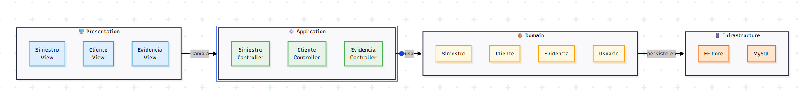

# ADR-04: SiteManager — Incorporación de API REST

| Campo  | Valor |
|--------|-------|
| Autor  | Ángela Rojas |
| Fecha  | 19/06/2026 |
| Estado | `Propuesto` |

---

## Contexto

SiteManager es una aplicación web que busca digitalizar la gestión de siniestros, levantamientos y reparaciones de obra. El sistema maneja varias entidades que se relacionan entre sí, como Siniestro, Cliente, Evidencia y Cotización, además de flujos de trabajo definidos que van desde el registro de un caso hasta su cierre.

Al ser un proyecto individual con un tiempo limitado a la duración del cuatrimestre, se necesita un estilo arquitectónico que sea claro, fácil de mantener por una sola persona y que sea compatible con las tecnologías ya elegidas: ASP.NET Core, Razor Pages, Entity Framework Core y MySQL.

SiteManager actualmente expone toda su funcionalidad a través de Razor Pages, donde el usuario interactúa directamente desde el navegador con formularios y vistas HTML. Esto funciona bien para los usuarios internos del sistema, como técnicos, supervisores y arquitectos, pero limita la posibilidad de que otros sistemas externos puedan consultar o enviar información a SiteManager sin pasar por una pantalla.

Conforme el proyecto avanza, surge la necesidad de exponer la información de forma más estructurada y accesible, de manera que otros sistemas puedan comunicarse con SiteManager directamente. Para esto se requiere incorporar una forma de intercambiar datos en un formato estándar, sin depender únicamente de las páginas web ya existentes.

---

## Decisión

Se decidió incorporar una **API REST** a SiteManager, implementada con **ASP.NET Core Web API**, comenzando con el módulo de **Siniestros**. La API expone las operaciones básicas de Crear, Leer, Actualizar y Eliminar (CRUD) mediante los siguientes endpoints:

| Método HTTP | Ruta | Función |
|---|---|---|
| `GET` | `/api/siniestros` | Obtener todos los siniestros |
| `GET` | `/api/siniestros/{id}` | Obtener un siniestro específico por ID |
| `POST` | `/api/siniestros` | Crear un nuevo siniestro |
| `PUT` | `/api/siniestros/{id}` | Actualizar un siniestro existente |
| `DELETE` | `/api/siniestros/{id}` | Eliminar un siniestro |

La API convive con las Razor Pages ya existentes dentro del mismo proyecto. Razor Pages sigue siendo la forma en que el usuario interactúa visualmente con el sistema, mientras que la API REST es una puerta adicional que entrega y recibe datos en formato JSON, pensada para sistemas externos. La documentación de los endpoints se hace mediante **Swagger**, que es el estándar de la industria para documentar APIs.

**¿Por qué REST?** REST es un estilo ampliamente adoptado en la industria porque utiliza el protocolo HTTP de forma estándar: cada método (GET, POST, PUT, DELETE) tiene un significado claro y predecible. Esto facilita que cualquier desarrollador externo entienda cómo consumir la API sin necesidad de documentación extensa adicional. Además, REST es compatible de forma natural con ASP.NET Core Web API, lo que evita agregar dependencias o tecnologías externas al proyecto.

---

**Detalle de cada endpoint:**

- **`GET /api/siniestros`** — Devuelve la lista completa de siniestros registrados en el sistema, incluyendo sus datos principales como cliente, tipo de daño y estado actual. Útil para que un sistema externo consulte todos los casos existentes de un vistazo.

- **`GET /api/siniestros/{id}`** — Devuelve la información detallada de un siniestro específico a partir de su identificador. Si el siniestro no existe, la API responde con un código 404 (No encontrado).

- **`POST /api/siniestros`** — Permite crear un nuevo siniestro enviando los datos necesarios (cliente, tipo de daño, dirección, descripción) en el cuerpo de la petición. Si el registro es exitoso, la API responde con un código 200 junto con el siniestro recién creado.

- **`PUT /api/siniestros/{id}`** — Permite actualizar la información de un siniestro existente, como su estado o descripción. Si el siniestro no existe, responde con un código 404; si la actualización es correcta, responde con un código 204 (Sin contenido).

- **`DELETE /api/siniestros/{id}`** — Elimina un siniestro del sistema a partir de su identificador. Se utiliza, por ejemplo, cuando un caso fue registrado por error. Responde con un código 200 si la eliminación fue exitosa, o 404 si el siniestro no existe.

---

### ASP.NET Core y C#

Se eligió ASP.NET Core como framework principal del backend por su soporte nativo al patrón MVC.

**¿Por qué?** ASP.NET Core implementa MVC de forma nativa, lo que reduce la configuración manual y permite enfocarse en la lógica del negocio. 

---

### Base de datos: MySQL

Se eligió MySQL como motor de base de datos relacional.

**¿Por qué?** Es una base de datos relacional que permite organizar bien la información del sistema. Es ideal ya que las entidades están relacionadas entre sí (por ejemplo, clientes, siniestros y evidencias), y MySQL ayuda a mantener esa relación de forma ordenada y consistente. También es fácil de usar, instalar y tiene mucha documentación, lo que la hace adecuada para un proyecto pequeño.

---

### Entity Framework

Se usará Entity Framework Core para conectar las clases de C# con la base de datos MySQL.

**¿Por qué?** Permite trabajar las tablas como si fueran clases en el código, lo que hace más fácil mantener todo organizado y consistente. Además, permite hacer cambios en la base de datos de forma controlada mediante migraciones, sin tener que modificarla manualmente cada vez.

---

### Alternativas consideradas

| Alternativa | Por qué la descarté |
|---|---|
| **Microservicios** | Requiere dividir el sistema en servicios completamente independientes, cada uno con su propia base de datos, despliegue y comunicación entre sí. SiteManager maneja entidades muy relacionadas entre sí, como Siniestros, Clientes y Evidencias, por lo que separarlas en servicios distintos complicaría innecesariamente algo que funciona mejor unido. Además, al ser un proyecto individual que corre en entorno local, mantener múltiples servicios corriendo al mismo tiempo sería difícil de gestionar. |
| **Arquitectura Hexagonal** | Es un estilo muy limpio que separa la lógica de negocio de todo lo externo, como la base de datos o la interfaz. Sin embargo, para aplicarlo correctamente se necesitan interfaces, adaptadores y puertos que agregan capas de abstracción que SiteManager no necesita en este momento. La Arquitectura en Capas ya logra esa separación de forma más directa y sin tanta configuración adicional. |
| **Event-Driven** | Este estilo funciona cuando el sistema necesita reaccionar a muchos eventos de forma desacoplada y en tiempo real. SiteManager tiene flujos de trabajo lineales y bien definidos: el usuario registra un siniestro, el controlador lo procesa y EF Core lo guarda en MySQL. No hay necesidad de un sistema de eventos para coordinar eso, ya que el flujo es predecible y directo. |
| **Serverless** | Implica dividir toda la lógica en funciones independientes desplegadas en la nube. SiteManager actualmente corre en entorno local con ASP.NET Core como un solo proyecto, y toda su estructura, desde los controladores hasta el contexto de Entity Framework Core, está pensada para funcionar como una aplicación unificada. Migrar a serverless implicaría reescribir gran parte de lo ya definido en el ADR-01 y ADR-02. | por una sola persona, este estilo no encaja con la realidad del proyecto. |

---

## Consecuencias

**✅ Lo que gano:**

- **Técnico:** La separación en capas hace que cada parte del sistema tenga una responsabilidad clara. Si necesito cambiar cómo se ve una pantalla, solo toco Razor Pages sin afectar la lógica de negocio. Si cambio cómo se guarda un siniestro en la base de datos, solo toco la capa de Infrastructure sin que las demás capas se enteren. Eso hace que el código sea más fácil de mantener y modificar conforme el proyecto avanza.

- **Proceso:** Al trabajar sola, tener capas bien definidas me permite concentrarme en una parte del sistema a la vez sin perder el hilo de lo que hace cada cosa. La estructura es predecible: siempre sé que la lógica vive en los controladores, las entidades en los modelos y el acceso a datos en Entity Framework Core.

- **Coherencia:** Este estilo es completamente compatible con las decisiones tomadas en el ADR-01 y ADR-02. No requiere cambiar el stack tecnológico ni la organización del proyecto, sino que formaliza y documenta la estructura que SiteManager ya tiene de forma natural.

**⚠️ Lo que sacrifico o asumo:**

- **Limitación técnica:** En la Arquitectura en Capas, las capas superiores dependen de las inferiores. Si en algún momento se quisiera cambiar MySQL por otro motor de base de datos, ese cambio afectaría la capa de Infrastructure y potencialmente la de Domain, lo que requeriría revisar las migraciones y el contexto de Entity Framework Core.

- **Escalabilidad limitada:** Este estilo funciona muy bien para el tamaño actual de SiteManager, pero si el sistema creciera significativamente en funcionalidades o usuarios concurrentes, la Arquitectura en Capas podría volverse un cuello de botella. En ese escenario, migrar a un estilo como microservicios sería el siguiente paso natural.

---

## Diagrama

Un boceto de cómo se estructura tu sistema (draw.io, Mermaid o a mano escaneado)

---

## Cláusula de IA 

Se utilizó inteligencia artificial como herramienta de apoyo en las siguientes tareas:

- Generación del código Mermaid para el diagrama de Arquitectura en Capas
- Apoyo en la estructuración del ADR-03
- Sugerencias para argumentar y justificar el estilo arquitectónico elegido con base en las decisiones previas del ADR-01 y ADR-02
- Apoyo para redactar las alternativas descartadas con argumentos coherentes al contexto del proyecto

