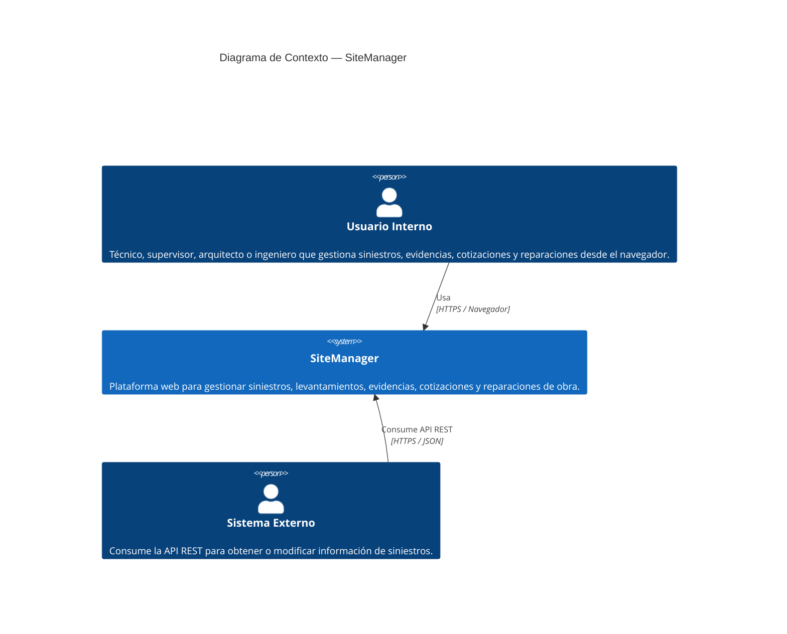

# Modelo C4 — SiteManager

---

## Nivel 1 — Contexto
 
- **¿Para quién es este diagrama?** Para stakeholders no técnicos como clientes o directivos que necesitan entender el sistema sin entrar en detalles técnicos.

- **¿Qué es el sistema?** Una vista de alto nivel que responde quién interactúa con SiteManager y qué resuelve. En este nivel no importa cómo está construido por dentro, solo qué hace y para quién existe.

