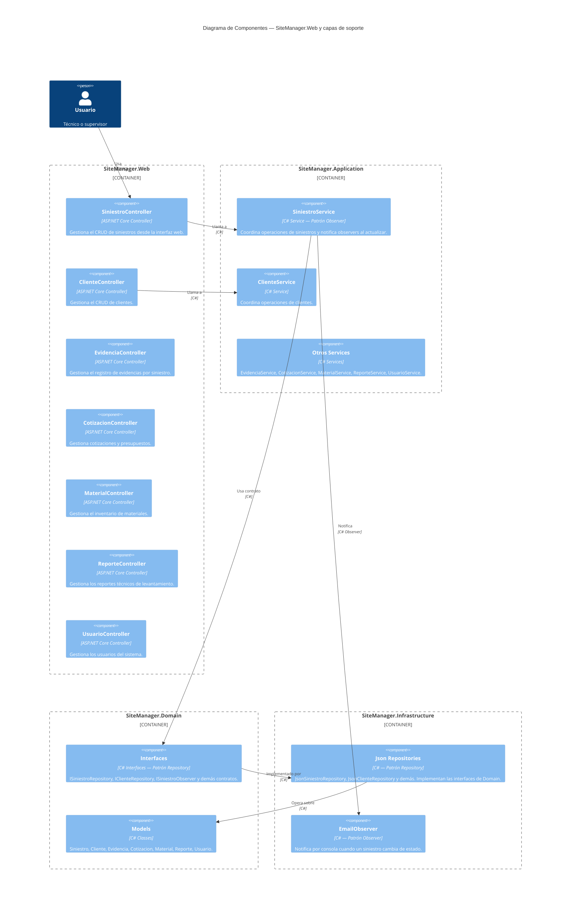

## Nivel 3 — Componentes

- **¿Para quién es?** Para desarrolladores, líderes técnicos y arquitectos de software que necesitan entender cómo está estructurado el código fuente y cómo interactúan las clases principales del sistema. 

- **¿Qué muestra este diagrama?**  Hace un "zoom in" (lupa) a los contenedores principales de SiteManager (`Web`, `Application`, `Domain` e `Infrastructure`). Muestra los bloques de construcción internos como: controladores, servicios, interfaces y repositorios— detallando cómo se aplica la arquitectura limpia y qué patrones de diseño (como *Repository* y *Observer*) gobiernan el flujo de la aplicación.

