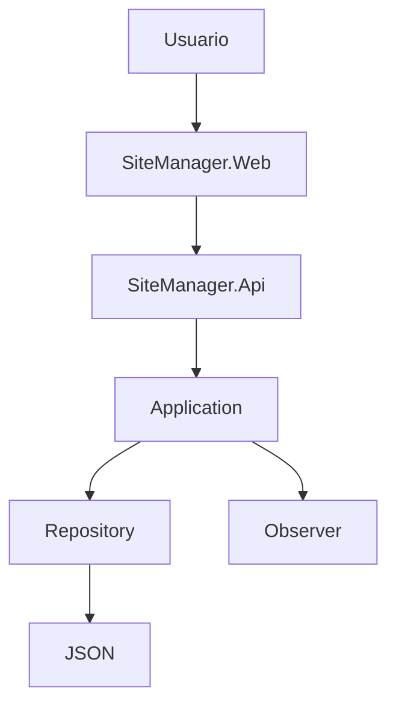
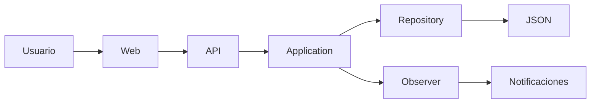

# 🎯 SiteManager - Rama GOF

> **Cuarta evolución del proyecto SiteManager.**

En esta etapa se incorporan **patrones de diseño GOF (Gang of Four)** para mejorar la organización interna del sistema, reducir el acoplamiento entre componentes y facilitar el mantenimiento del código. A diferencia de las evoluciones anteriores, esta versión no modifica la arquitectura general de la solución, sino que fortalece su diseño interno mediante la implementación de los patrones **Repository** y **Observer**.


---

# 📑 Tabla de contenido

- Introducción
- Evolución del proyecto
- Objetivos
- Cambios implementados
- Decisión Arquitectónica (ADR-05)
- Problemas identificados
- Patrones implementados
- Arquitectura del sistema
- Estructura de la solución
- Descripción de los proyectos
- Tecnologías utilizadas
- Recursos de desarrollo
- Persistencia de datos
- Beneficios obtenidos
- Módulos del sistema
- Instalación y ejecución
- Capturas de pantalla
- Próximas mejoras
- Información del proyecto
- Uso de Inteligencia Artificial

---

# 📖 Introducción

Después de incorporar una API REST en la evolución anterior, el siguiente paso consistió en mejorar la calidad del diseño interno del sistema.

Durante el desarrollo se identificaron componentes que podían beneficiarse de una mejor separación de responsabilidades. En particular, el acceso a los datos y el mecanismo de notificaciones presentaban un mayor nivel de acoplamiento del deseado.

Para resolver estas situaciones se decidió implementar dos patrones de diseño GOF:

- **Repository**, para abstraer el acceso al mecanismo de persistencia.
- **Observer**, para desacoplar el proceso de notificación cuando un siniestro cambia de estado.

Es importante mencionar que esta evolución mantiene la Arquitectura en Capas implementada previamente; los cambios realizados se enfocan únicamente en mejorar la organización interna del código y facilitar futuras ampliaciones del sistema.

---

# 🚀 Evolución respecto a la rama API

La implementación de patrones GOF representa una mejora en el diseño del software sin alterar la funcionalidad principal de la aplicación.

| Rama API | Rama GOF |
|-----------|-----------|
| API REST funcional. | Se incorporan patrones de diseño GOF. |
| Comunicación mediante HTTP y JSON. | Se mantiene la comunicación existente. |
| Persistencia temporal mediante archivos JSON. | Se conserva la persistencia en JSON, ahora desacoplada mediante Repository. |
| Lógica de notificaciones integrada. | Notificaciones gestionadas mediante Observer. |
| ADR-04. | ADR-05. |

Esta evolución demuestra cómo una arquitectura bien organizada permite incorporar mejoras internas sin afectar el funcionamiento general del sistema.

---

# 🎯 Objetivos de esta evolución

Los principales objetivos de esta etapa fueron:

- Reducir el acoplamiento entre componentes.
- Mejorar la mantenibilidad del código.
- Separar responsabilidades mediante patrones de diseño.
- Facilitar futuras modificaciones del sistema.
- Preparar la aplicación para futuras evoluciones del mecanismo de persistencia.
- Aplicar patrones GOF adecuados al contexto del proyecto.

---

# 🔄 Cambios implementados

Durante esta evolución se realizaron las siguientes mejoras:

- Implementación del patrón **Repository**.
- Implementación del patrón **Observer**.
- Reorganización del acceso a la persistencia.
- Separación de la lógica de notificaciones.
- Mayor reutilización de componentes.
- Mejor preparación para futuras ampliaciones del sistema.
- Actualización de la documentación arquitectónica mediante ADR-05.

---

# 📚 Decisión Arquitectónica (ADR-05)

## Integración de Patrones de Diseño GOF

En esta etapa se documentó la incorporación de dos patrones de diseño pertenecientes al catálogo GOF.

La decisión surge de la necesidad de reducir el acoplamiento existente en determinados componentes del sistema y mejorar la mantenibilidad del código sin modificar la arquitectura implementada en etapas anteriores.

Los patrones seleccionados fueron:

- **Repository**, perteneciente a la categoría estructural.
- **Observer**, perteneciente a la categoría de comportamiento.

Ambos patrones fueron elegidos por responder directamente a necesidades reales identificadas durante el desarrollo de SiteManager.

---

# ⚠️ Problemas identificados

Antes de esta evolución se detectaron dos aspectos susceptibles de mejora.

## Acceso a la persistencia

El acceso al mecanismo de almacenamiento se encontraba demasiado ligado a los componentes que utilizaban la información.

Aunque actualmente la aplicación continúa utilizando archivos JSON como almacenamiento temporal, era conveniente desacoplar esta responsabilidad para facilitar una futura migración a otro sistema de persistencia.

---

## Gestión de notificaciones

Cuando un siniestro cambia de estado, el sistema necesita generar una notificación.

Sin un mecanismo especializado, esta responsabilidad puede terminar mezclándose con otras funciones del sistema, dificultando su mantenimiento conforme la aplicación crece.

---

# 🧩 Patrones implementados

## Repository

El patrón **Repository** encapsula el acceso al mecanismo de persistencia utilizado por la aplicación.

Gracias a esta implementación, la lógica de negocio ya no necesita conocer cómo se almacenan o recuperan los datos.

Actualmente el repositorio trabaja sobre archivos JSON, pero esta abstracción permitirá reemplazar el mecanismo de persistencia en futuras versiones sin modificar el resto del sistema.

### Beneficios

- Menor acoplamiento.
- Mayor reutilización.
- Código más limpio.
- Facilita futuras migraciones de persistencia.

---

## Observer

El patrón **Observer** permite que un objeto notifique automáticamente a otros cuando ocurre un cambio importante.

En SiteManager se utiliza para gestionar las notificaciones cuando un siniestro cambia de estado.

De esta forma, la lógica de notificación queda completamente desacoplada del resto de la aplicación.

### Beneficios

- Separación de responsabilidades.
- Facilidad para agregar nuevos tipos de notificación.
- Mayor escalabilidad.
- Mejor mantenimiento del código.

---

# 🏛 Arquitectura del sistema

La arquitectura general permanece igual que en la rama API.

Los cambios se concentran en la organización interna del código.



Los patrones GOF se integran sobre la Arquitectura en Capas previamente implementada, fortaleciendo el diseño sin modificar la estructura principal del sistema.

---

# 📂 Estructura de la solución

```text
SiteManager

├── SiteManager.Web
├── SiteManager.Api
├── SiteManager.Application
├── SiteManager.Domain
└── SiteManager.Infrastructure
```

La estructura general de la solución permanece estable; la evolución se centra en la incorporación de nuevas interfaces y clases relacionadas con los patrones Repository y Observer.

---

# 💻 Tecnologías utilizadas

| Tecnología | Uso |
|------------|-----|
| ASP.NET Core MVC | Aplicación web principal. |
| ASP.NET Core Web API | Servicios REST. |
| C# | Lógica del sistema. |
| Arquitectura en Capas | Organización del proyecto. |
| Repository Pattern | Abstracción del acceso a datos. |
| Observer Pattern | Gestión de notificaciones. |
| JSON | Persistencia temporal de información. |
| HTTP | Comunicación entre clientes y la API. |
| Swagger / OpenAPI | Documentación y pruebas de la API. |
| HTML5 | Estructura de las vistas. |
| CSS3 | Diseño de la interfaz. |
| Bootstrap 5 | Diseño responsivo. |
| JavaScript | Funcionalidades del cliente. |
| Git | Control de versiones. |
| GitHub | Administración del repositorio. |

---

# 🛠 Recursos de desarrollo

- Visual Studio 2022
- .NET SDK
- Git
- GitHub
- Bootstrap 5
- Swagger UI
- Archivos JSON como almacenamiento temporal

---

# 💾 Persistencia de datos

Al igual que en la evolución anterior, **SiteManager continúa utilizando archivos JSON como mecanismo de persistencia temporal**.

La implementación del patrón **Repository** no modifica la tecnología de almacenamiento utilizada, sino que abstrae el acceso a los datos para evitar que el resto del sistema dependa directamente del mecanismo de persistencia.

Gracias a esta separación, una futura migración hacia un sistema gestor de bases de datos, como MySQL u otro motor relacional, podrá realizarse con un impacto mucho menor sobre la lógica de negocio y la interfaz de usuario.

---

# 🔄 Comunicación entre componentes

La incorporación de los patrones GOF no modifica el flujo principal de comunicación del sistema; sin embargo, mejora la forma en que los distintos componentes interactúan entre sí.



En este flujo:

- **Repository** centraliza el acceso al almacenamiento.
- **Observer** gestiona las notificaciones derivadas de cambios importantes dentro del sistema.
- La lógica de negocio permanece independiente del mecanismo de persistencia y del sistema de notificaciones.

---

# 📈 Beneficios obtenidos

La implementación de los patrones GOF aporta diversas ventajas al proyecto.

## Repository

- Reduce el acoplamiento entre la lógica de negocio y la persistencia.
- Facilita el mantenimiento del código.
- Centraliza el acceso a los datos.
- Prepara el sistema para futuras migraciones de almacenamiento.

## Observer

- Desacopla la lógica de notificaciones.
- Facilita la incorporación de nuevos tipos de observadores.
- Evita modificar clases existentes para agregar nuevas acciones.
- Favorece el cumplimiento del principio de responsabilidad única.

---

# ⚖️ Comparativa antes y después

| Antes | Después |
|--------|----------|
| Acceso directo al mecanismo de persistencia. | Acceso centralizado mediante Repository. |
| Notificaciones mezcladas con otras responsabilidades. | Notificaciones desacopladas mediante Observer. |
| Mayor dependencia entre componentes. | Menor acoplamiento y mayor reutilización. |
| Cambios más difíciles de mantener. | Código más organizado y preparado para crecer. |

---

# 📋 Módulos del sistema

La incorporación de los patrones GOF no modifica las funcionalidades principales de SiteManager.

Los módulos disponibles continúan siendo:

- Inicio
- Gestión de Siniestros
- Clientes
- Evidencias
- Materiales
- Cotizaciones
- Usuarios

Los cambios introducidos en esta rama se enfocan en la organización interna del código que soporta dichos módulos.

---

# ⚙️ Requisitos

Para ejecutar el proyecto se requiere:

- Visual Studio 2022
- .NET SDK
- Git
- Navegador web
- Swagger UI (para pruebas de la API)

---

# 🚀 Instalación y ejecución

Clonar el repositorio:

```bash
git clone https://github.com/angela-rojas05/App-SiteManager.git
```

Ingresar al proyecto:

```bash
cd SiteManager
```

Restaurar dependencias:

```bash
dotnet restore
```

Compilar la solución:

```bash
dotnet build
```

Ejecutar el proyecto:

```bash
dotnet run
```

Una vez iniciado, la aplicación web y la API podrán ejecutarse desde Visual Studio utilizando el perfil correspondiente.

---

# 🧪 Pruebas realizadas

Durante esta evolución se realizaron pruebas para verificar:

- El correcto funcionamiento del patrón **Repository** durante las operaciones de acceso a la información.
- La correcta ejecución del patrón **Observer** cuando un siniestro cambia de estado.
- La integración de ambos patrones con la Arquitectura en Capas previamente implementada.
- El funcionamiento general de la aplicación sin afectar las funcionalidades existentes.

---

# 🖼 Capturas de pantalla

Se recomienda incluir imágenes de:

- Estructura de la solución mostrando las nuevas clases e interfaces.
- Implementación del patrón Repository.
- Implementación del patrón Observer.
- Ejecución de la aplicación.
- Swagger mostrando la API funcionando.
- Ejemplo del flujo de notificaciones.

---

# 🔔 Sistema de notificaciones

Como parte de la implementación del patrón **Observer**, SiteManager incorpora un mecanismo de notificaciones que permite reaccionar automáticamente cuando ocurre un cambio importante dentro del sistema.

En la implementación actual, el patrón se utiliza principalmente para gestionar las notificaciones asociadas a los **cambios de estado de un siniestro**, permitiendo que esta responsabilidad permanezca desacoplada de la lógica principal de la aplicación.

Algunos eventos contemplados son:

- 🔄 Cambio de estado de un siniestro.
- 📢 Generación de la notificación correspondiente al cambio de estado.

La arquitectura implementada permite incorporar nuevos observadores en el futuro sin modificar la lógica de negocio. Esto facilitará la integración de nuevos mecanismos de notificación, como correo electrónico, notificaciones dentro de la aplicación u otros canales, conforme el proyecto continúe evolucionando.

---

# 🚀 Próximas mejoras

Aunque esta evolución fortalece considerablemente el diseño interno del sistema, aún existen oportunidades para continuar mejorando la aplicación.

Entre las mejoras contempladas para futuras versiones se encuentran:

- Sustituir el almacenamiento temporal basado en archivos JSON por un sistema de persistencia relacional.
- Incorporar autenticación y autorización para los servicios REST.
- Ampliar la cobertura de los endpoints de la API.
- Implementar nuevos patrones de diseño cuando el crecimiento del sistema lo justifique.
- Continuar fortaleciendo la arquitectura siguiendo buenas prácticas de ingeniería de software.

---

# 👩‍💻 Información del proyecto

**Proyecto:** SiteManager

**Desarrollado por:** Ángela Rojas

**Materia:** Arquitectura de Software

**Repositorio:** *https://github.com/angela-rojas05/App-SiteManager.git*

**Versión:** Rama GOF (ADR-05)

**Licencia:** Uso académico.

---

# 🤖 Uso de Inteligencia Artificial

Durante el desarrollo de esta etapa del proyecto se utilizó **ChatGPT (OpenAI)** como herramienta de apoyo en tareas específicas, entre ellas:

- Apoyo en la resolución de errores (debugging) durante la implementación de los patrones de diseño.
- Sugerencias para la correcta aplicación de los patrones **Repository** y **Observer** dentro de la Arquitectura en Capas.
- Recomendaciones para mejorar la organización del código y reducir el acoplamiento entre componentes.
- Apoyo en el diseño visual de la aplicación, incluyendo estilos, distribución de elementos y mejoras en la experiencia de usuario.
- Asistencia en la redacción y organización de la documentación técnica del proyecto, incluyendo este README y la documentación de apoyo.

La implementación del código, la integración de los patrones de diseño, las decisiones arquitectónicas, las pruebas realizadas y la validación del funcionamiento del sistema fueron responsabilidad de la autora del proyecto.

---

# 📚 Evolución del proyecto

Este repositorio documenta el desarrollo progresivo de **SiteManager**, mostrando cómo la aplicación fue evolucionando en distintas etapas arquitectónicas y de diseño.

| Rama | Evolución | ADR |
|------|-----------|-----|
| **Main** | Implementación inicial utilizando el patrón MVC. | ADR-01 |
| **Capas** | Migración hacia una Arquitectura en Capas. | ADR-02 y ADR-03 |
| **API** | Incorporación de una API REST para exponer servicios mediante HTTP y JSON. | ADR-04 |
| **GOF** | Integración de los patrones Repository y Observer para mejorar el diseño interno del sistema. | ADR-05 |

Cada rama representa una etapa independiente del proceso evolutivo del proyecto, permitiendo observar cómo las decisiones arquitectónicas y de diseño fueron fortaleciendo progresivamente la calidad, organización y mantenibilidad de la aplicación.