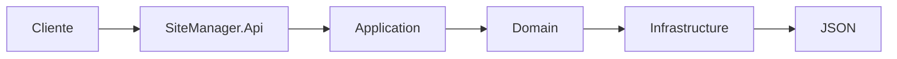
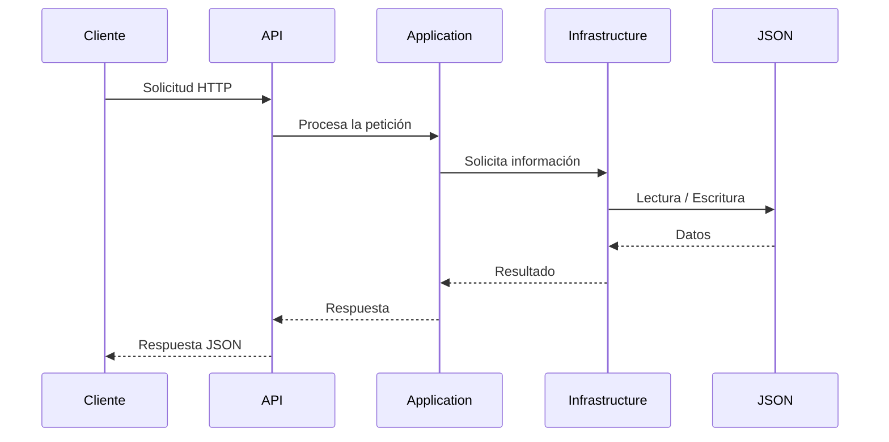

# 🌐 SiteManager - Rama API

> **Tercera evolución del proyecto SiteManager.**

En esta etapa se incorpora una **API REST** que permite exponer parte de las funcionalidades del sistema mediante servicios HTTP, aprovechando la Arquitectura en Capas implementada en la evolución anterior. La incorporación de este nuevo proyecto demuestra cómo una arquitectura correctamente organizada facilita la integración de nuevos componentes sin afectar la lógica de negocio existente.


---

# 📑 Tabla de contenido

- Introducción
- Evolución del proyecto
- Objetivos
- Cambios implementados
- Decisión Arquitectónica (ADR-04)
- Arquitectura del sistema
- Estructura de la solución
- Descripción de los proyectos
- Comunicación entre componentes
- Tecnologías utilizadas
- Recursos de desarrollo
- Persistencia de datos
- Estado de la API
- Endpoints implementados
- Módulos del sistema
- Instalación y ejecución
- Capturas de pantalla
- Próximas mejoras
- Información del proyecto
- Uso de Inteligencia Artificial

---

# 📖 Introducción

Después de reorganizar el proyecto mediante una Arquitectura en Capas, el siguiente paso consistió en ampliar las capacidades del sistema mediante la incorporación de una **API REST**.

Gracias a la separación de responsabilidades implementada en la rama **Capas**, fue posible agregar un nuevo proyecto llamado **SiteManager.Api**, reutilizando las capas **Application**, **Domain** e **Infrastructure**, sin duplicar lógica ni alterar el funcionamiento de la aplicación web.

Esta evolución permite que la información administrada por SiteManager pueda ser consumida mediante solicitudes HTTP, facilitando futuras integraciones con aplicaciones web, móviles o cualquier cliente compatible con servicios REST.

Es importante mencionar que esta etapa representa una implementación **funcional**, cuyo propósito es demostrar la correcta integración de la API con la arquitectura existente. Aunque varios endpoints ya se encuentran disponibles, la cobertura de funcionalidades aún no está completa y continuará desarrollándose en futuras versiones del proyecto.

---

# 🚀 Evolución respecto a la rama Capas

La Arquitectura en Capas permitió incorporar nuevos componentes sin modificar la estructura principal del sistema.

| Rama Capas | Rama API |
|------------|-----------|
| Arquitectura en Capas implementada. | Se incorpora un proyecto Web API independiente. |
| Comunicación interna entre capas. | Comunicación mediante HTTP y JSON. |
| Sin servicios REST. | Exposición de endpoints REST. |
| Solo aplicación MVC. | Aplicación MVC + API REST. |
| ADR-02 y ADR-03. | ADR-04. |

Esta evolución demuestra cómo una arquitectura bien organizada facilita la incorporación de nuevas tecnologías sin afectar el resto del sistema.

---

# 🎯 Objetivos de esta evolución

Durante esta etapa se plantearon los siguientes objetivos:

- Incorporar una API REST al proyecto.
- Reutilizar la Arquitectura en Capas desarrollada previamente.
- Exponer funcionalidades mediante servicios HTTP.
- Utilizar JSON como formato de intercambio de información.
- Validar el correcto funcionamiento de la arquitectura mediante endpoints funcionales.
- Preparar la solución para futuras integraciones con clientes externos.

---

# 🔄 Cambios implementados

La tercera evolución del proyecto incorpora diversas mejoras respecto a la versión anterior.

Entre los cambios más importantes se encuentran:

- Creación del proyecto **SiteManager.Api**.
- Configuración de ASP.NET Core Web API.
- Implementación inicial de controladores REST.
- Comunicación mediante HTTP.
- Intercambio de información utilizando JSON.
- Integración con las capas Application, Domain e Infrastructure.
- Configuración de Swagger/OpenAPI para documentar y probar los servicios.
- Reutilización completa de la lógica de negocio existente.

---

# 📚 Decisión Arquitectónica (ADR-04)

## ADR-04 – Incorporación de una API REST

Durante esta evolución se decidió integrar una API REST como mecanismo de comunicación entre SiteManager y posibles consumidores externos.

La incorporación de este nuevo proyecto fue posible gracias a la Arquitectura en Capas implementada previamente, permitiendo reutilizar la lógica del sistema sin duplicar código y manteniendo una clara separación de responsabilidades.

Esta decisión representa un paso importante hacia una arquitectura más flexible y preparada para futuras integraciones.

---

# 🏛 Arquitectura del sistema

La arquitectura mantiene la organización implementada en la rama Capas, incorporando un nuevo punto de acceso mediante la API.



La aplicación web continúa funcionando normalmente, mientras que la API reutiliza los mismos servicios internos para responder a solicitudes externas.

---

# 📂 Estructura de la solución

```text
SiteManager

├── SiteManager.Web
├── ⭐ SiteManager.Api
├── SiteManager.Application
├── SiteManager.Domain
└── SiteManager.Infrastructure
```

**Nuevo proyecto incorporado:**

⭐ **SiteManager.Api**, encargado de exponer los servicios REST del sistema.

---

# 📁 Descripción de los proyectos

## SiteManager.Web

Contiene la aplicación MVC utilizada por el usuario final, incluyendo las vistas Razor, controladores y recursos gráficos.

---

## SiteManager.Api

Proyecto incorporado durante esta evolución.

Su responsabilidad consiste en exponer parte de la funcionalidad del sistema mediante servicios REST utilizando HTTP y JSON.

Además, integra Swagger para facilitar las pruebas y documentación de los endpoints implementados.

---

## SiteManager.Application

Implementa la lógica de negocio reutilizada tanto por la aplicación web como por la API.

---

## SiteManager.Domain

Contiene las entidades principales y las reglas del dominio utilizadas por toda la solución.

---

## SiteManager.Infrastructure

Gestiona la persistencia temporal de la información mediante archivos JSON y proporciona los servicios de acceso a datos requeridos por la aplicación.

---

# 💻 Tecnologías utilizadas

| Tecnología | Uso dentro del proyecto |
|------------|--------------------------|
| ASP.NET Core MVC | Aplicación web principal. |
| ASP.NET Core Web API | Desarrollo de la API REST. |
| C# | Implementación de la lógica del sistema. |
| HTTP | Comunicación entre clientes y la API. |
| JSON | Formato para el intercambio y almacenamiento temporal de información. |
| Swagger / OpenAPI | Documentación y pruebas de la API. |
| HTML5 | Estructura de las vistas. |
| CSS3 | Diseño de la interfaz. |
| Bootstrap 5 | Diseño responsivo. |
| JavaScript | Interacciones del cliente. |
| Git | Control de versiones. |
| GitHub | Administración del repositorio. |

---

# 🛠 Recursos de desarrollo

- Visual Studio 2022
- .NET SDK
- Swagger UI
- Git
- GitHub
- Bootstrap 5
- Archivos JSON como almacenamiento temporal

---

# 💾 Persistencia de datos

En esta etapa del proyecto **aún no se utiliza una base de datos relacional**. La persistencia de la información continúa realizándose mediante **archivos JSON**, los cuales funcionan como un almacenamiento temporal para demostrar el correcto funcionamiento de la aplicación y de la Arquitectura en Capas.

Esta decisión permite centrar el desarrollo en la integración entre la aplicación web, la API REST y las diferentes capas del sistema antes de incorporar un motor de base de datos.

La migración hacia **MySQL** se encuentra contemplada como una evolución futura del proyecto, permitiendo reemplazar el almacenamiento temporal por una solución de persistencia más robusta, escalable y preparada para ambientes de producción.

---

# 📡 Estado actual de la API

La API implementada en esta rama es **funcional** y permite demostrar la correcta comunicación entre los distintos componentes del sistema mediante el protocolo **HTTP** y el formato **JSON**.

Es importante señalar que **los endpoints aún no se encuentran completamente implementados**. Los servicios disponibles representan una primera etapa del desarrollo y tienen como objetivo validar que la arquitectura funciona correctamente y que la lógica del sistema puede ser consumida desde clientes externos.

En futuras versiones se continuará ampliando la cobertura de la API incorporando nuevos recursos y operaciones.

---

# 🔗 Comunicación mediante HTTP y JSON

La comunicación entre los clientes y la API se realiza utilizando el protocolo **HTTP**, mientras que el intercambio de información se lleva a cabo mediante objetos **JSON**.

Este enfoque permite que cualquier cliente compatible con servicios REST (como aplicaciones web, aplicaciones móviles o herramientas de prueba como Swagger y Postman) pueda consumir los servicios de manera sencilla y estandarizada.

El flujo general de comunicación es el siguiente:



---

# 🌐 Endpoints implementados

Durante esta etapa se desarrolló una primera versión de la API con endpoints funcionales que permiten demostrar la integración entre la Arquitectura en Capas y los servicios REST.

| Método | Descripción |
|---------|-------------|
| GET | Consulta de información. |
| POST | Registro de nuevos elementos. |
| PUT | Actualización de información existente. |
| DELETE | Eliminación de registros. |

> **Nota:** Los recursos disponibles dependen de los módulos actualmente implementados. La cobertura de la API continuará ampliándose conforme evolucione el proyecto.

---

# 📋 Módulos disponibles

La incorporación de la API no modifica las funcionalidades del sistema, sino que proporciona una nueva forma de acceder a ellas.

Actualmente la solución continúa integrando módulos como:

- Inicio
- Gestión de Siniestros
- Clientes
- Evidencias
- Materiales
- Cotizaciones
- Usuarios

Los endpoints implementados permiten validar el funcionamiento de algunos de estos módulos, mientras que el resto será incorporado en futuras iteraciones.

---

# ⚙️ Requisitos

Para ejecutar el proyecto es necesario contar con:

- Visual Studio 2022
- .NET SDK
- Git
- Navegador web
- Swagger UI (incluido en el proyecto)

---

# 🚀 Instalación y ejecución

Clonar el repositorio:

```bash
git clone https://github.com/angela-rojas05/App-SiteManager.git
```

Ingresar al proyecto:

```bash
cd SiteManager
```

Restaurar dependencias:

```bash
dotnet restore
```

Compilar la solución:

```bash
dotnet build
```

Ejecutar la aplicación:

```bash
dotnet run
```

Una vez iniciada la API, Swagger estará disponible desde el navegador para consultar y probar los endpoints implementados.

---

# 🧪 Pruebas realizadas

Las pruebas de esta etapa estuvieron enfocadas en comprobar la correcta comunicación entre las diferentes capas del sistema mediante la API.

Para ello se utilizaron herramientas como:

- Swagger UI
- Navegador Web
- Postman *(si aplica)*

Las pruebas permitieron verificar:

- Correcta recepción de solicitudes HTTP.
- Respuestas en formato JSON.
- Comunicación entre la API y la capa de aplicación.
- Acceso a la persistencia temporal mediante archivos JSON.

---

# 🖼 Capturas de pantalla

Se recomienda incluir capturas de:

- Página principal de la aplicación.
- Estructura de la solución con el proyecto **SiteManager.Api**.
- Swagger UI mostrando los endpoints disponibles.
- Ejemplo de una respuesta en formato JSON.
- Consumo de un endpoint desde el navegador o Postman.

---

# 🚀 Próximas mejoras

Las siguientes etapas del proyecto contemplan:

- Completar la implementación de los endpoints restantes.
- Incorporar autenticación y autorización para los servicios REST.
- Migrar el almacenamiento temporal basado en JSON hacia una base de datos **MySQL**.
- Integrar Entity Framework Core para la gestión de la persistencia.
- Implementar patrones de diseño GOF para mejorar la flexibilidad, reutilización y mantenibilidad del sistema.

---

# 👩‍💻 Información del proyecto

**Proyecto:** SiteManager

**Desarrollado por:** Ángela Rojas

**Materia:** Arquitectura de Software

**Repositorio:** *https://github.com/angela-rojas05/App-SiteManager.git*

**Licencia:** Uso académico.

---

# 🤖 Uso de Inteligencia Artificial

Durante el desarrollo de esta etapa del proyecto se utilizó **ChatGPT (OpenAI)** como herramienta de apoyo en tareas específicas, entre ellas:

- Apoyo en la resolución de errores (debugging) relacionados con la implementación y configuración de la API REST.
- Recomendaciones para la integración del proyecto **SiteManager.Api** con la Arquitectura en Capas existente.
- Sugerencias para la configuración y validación de endpoints mediante Swagger.
- Apoyo en la mejora de la navegación y organización de la interfaz de usuario.
- Recomendaciones para el diseño visual de la aplicación, incluyendo estilos, distribución de elementos y selección de colores.
- Asistencia en la redacción y organización de la documentación técnica, incluyendo este README y el documento ADR-04.

La implementación del código, las decisiones arquitectónicas, la integración de las funcionalidades, las pruebas y la validación del proyecto fueron realizadas por la autora.