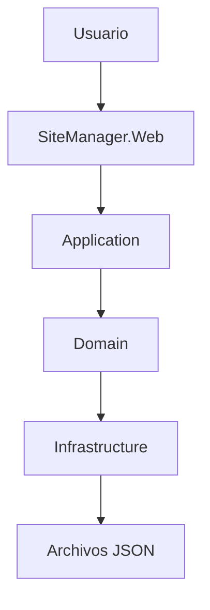

# 🏗️ 👷‍♂️ SiteManager - Rama Capas

> **Segunda evolución del proyecto SiteManager.**  
> En esta versión se realizó la migración desde una estructura basada únicamente en el patrón **Modelo-Vista-Controlador (MVC)** hacia una **Arquitectura en Capas (Layered Architecture)**, con el objetivo de mejorar la organización del código, la separación de responsabilidades y facilitar el crecimiento del sistema.


---

# 📑 Tabla de contenido

- Introducción
- Evolución del proyecto
- Objetivos de la migración
- Cambios implementados
- Decisiones Arquitectónicas (ADR)
- Arquitectura del sistema
- Estructura de la solución
- Descripción de los proyectos
- Reorganización del proyecto
- Tecnologías utilizadas
- Recursos de desarrollo
- Comunicación entre capas
- Módulos del sistema
- Requisitos
- Instalación
- Capturas de pantalla
- Próxima evolución
- Información del proyecto
- Uso de Inteligencia Artificial

---

# 📖 Introducción

Después de desarrollar la primera versión de **SiteManager** utilizando el patrón **Modelo-Vista-Controlador (MVC)**, se identificó la necesidad de reorganizar la estructura interna del proyecto.

Conforme la aplicación comenzó a crecer, mantener toda la lógica dentro de un único proyecto hacía más complicado el mantenimiento, la reutilización del código y la incorporación de nuevas funcionalidades.

Como respuesta a esta necesidad, en esta rama se implementó una **Arquitectura en Capas**, distribuyendo las responsabilidades del sistema en proyectos independientes sin modificar el funcionamiento general de la aplicación.

Esta evolución constituye la base para las siguientes etapas del proyecto, como la incorporación de una API REST y la implementación de patrones de diseño.

---

# 🚀 Evolución del proyecto

Esta rama representa la segunda etapa del desarrollo de SiteManager.

| Rama Main | Rama Capas |
|------------|------------|
| Proyecto desarrollado bajo MVC. | Migración hacia una Arquitectura en Capas. |
| Un único proyecto concentraba la mayor parte de la lógica. | La solución se divide en proyectos especializados. |
| Organización básica del sistema. | Separación clara de responsabilidades. |
| ADR-01. | ADR-02 y ADR-03. |

La funcionalidad del sistema permanece prácticamente igual; el cambio principal se encuentra en la arquitectura interna de la solución.

---

# 🎯 Objetivos de la migración

La implementación de la Arquitectura en Capas tuvo como propósito:

- Mejorar la organización del proyecto.
- Reducir el acoplamiento entre componentes.
- Facilitar el mantenimiento del código.
- Permitir una mejor reutilización de componentes.
- Preparar la aplicación para futuras integraciones.
- Establecer una arquitectura más escalable.

---

# 🔄 Cambios implementados

Durante esta evolución del proyecto se realizaron las siguientes modificaciones:

- Reorganización completa de la solución.
- Separación de responsabilidades entre proyectos.
- Creación de las capas **Application**, **Domain** e **Infrastructure**.
- Reubicación de la lógica de negocio fuera del proyecto web.
- Separación del acceso a datos.
- Conservación de la interfaz desarrollada en ASP.NET Core MVC.
- Actualización de la documentación arquitectónica mediante ADR.

---

# 📚 Decisiones Arquitectónicas (ADR)

## ADR-02 – Implementación de Vistas Arquitectónicas

En esta etapa se documentó la arquitectura utilizando diferentes perspectivas del sistema:

- Vista lógica
- Vista de desarrollo
- Vista de procesos
- Vista de despliegue

Estas vistas permiten comprender la estructura del proyecto desde distintos enfoques y facilitan su mantenimiento.

---

## ADR-03 – Arquitectura en Capas

Se decidió reorganizar el proyecto utilizando una Arquitectura en Capas.

La solución quedó dividida en diferentes proyectos, cada uno con una responsabilidad específica, permitiendo una mejor separación entre la presentación, la lógica del negocio, el dominio y la infraestructura.

---

# 🏛 Arquitectura del sistema

La comunicación entre componentes ahora sigue la siguiente estructura:



Cada capa tiene una responsabilidad específica y únicamente interactúa con la capa inmediatamente inferior.

---

# 📂 Estructura de la solución

```text
SiteManager

├── SiteManager.Web
├── SiteManager.Application
├── SiteManager.Domain
└── SiteManager.Infrastructure
```

---

# 📁 Descripción de los proyectos

## SiteManager.Web

Contiene la interfaz gráfica desarrollada con ASP.NET Core MVC, Razor Views, controladores y recursos estáticos utilizados por la aplicación.

---

## SiteManager.Application

Implementa la lógica de negocio del sistema y coordina las operaciones realizadas por cada uno de los módulos.

---

## SiteManager.Domain

Contiene las entidades principales del dominio, contratos y reglas del negocio que representan la información administrada por SiteManager.

---

## SiteManager.Infrastructure

Implementa los mecanismos de persistencia de la información utilizando archivos JSON y concentra los servicios encargados del acceso a datos.

---

# 🔄 Reorganización del proyecto

Una de las principales diferencias respecto a la rama Main fue la redistribución de responsabilidades.

| Antes (Main) | Después (Capas) |
|---------------|----------------|
| Models | Domain |
| Lógica de negocio dentro del proyecto web | Application |
| Persistencia dentro del proyecto principal | Infrastructure |
| MVC tradicional | MVC + Arquitectura en Capas |

Esta reorganización permite que cada proyecto tenga una responsabilidad claramente definida.

---

# 💻 Tecnologías utilizadas

| Tecnología | Uso dentro del proyecto |
|------------|--------------------------|
| ASP.NET Core MVC | Desarrollo de la aplicación web. |
| C# | Implementación de la lógica del sistema. |
| Razor Views | Construcción de las vistas dinámicas. |
| HTML5 | Estructura de la interfaz. |
| CSS3 | Diseño y estilos visuales. |
| Bootstrap 5 | Diseño responsivo. |
| JavaScript | Funcionalidades del lado del cliente. |
| JSON | Persistencia temporal de la información. |
| Git | Control de versiones. |
| GitHub | Administración del repositorio. |

---

# 🛠 Recursos de desarrollo

- Visual Studio 2022
- .NET SDK
- Bootstrap
- Git
- GitHub
- Archivos JSON
- Razor Pages

---

# 🔗 Comunicación entre capas

El flujo de una solicitud dentro de la aplicación puede resumirse de la siguiente forma:

```text
Usuario
      │
      ▼
SiteManager.Web
      │
      ▼
Application
      │
      ▼
Domain
      │
      ▼
Infrastructure
      │
      ▼
JSON
```

Gracias a esta separación, cada componente puede evolucionar de forma independiente.

---

# 📋 Módulos del sistema

La migración arquitectónica no modificó las funcionalidades principales del sistema.

Entre los módulos disponibles se encuentran:

- Inicio
- Gestión de Siniestros
- Clientes
- Evidencias
- Materiales
- Cotizaciones
- Usuarios

Cada módulo continúa ofreciendo operaciones CRUD, pero ahora la lógica se encuentra distribuida entre las diferentes capas de la solución.

---

# ⚙ Requisitos

- Visual Studio 2022
- .NET SDK
- Git

---

# 🚀 Instalación

Clonar el repositorio

```bash
git clone https://github.com/angela-rojas05/App-SiteManager.git
```

Entrar al proyecto

```bash
cd SiteManager
```

Restaurar dependencias

```bash
dotnet restore
```

Compilar

```bash
dotnet build
```

Ejecutar

```bash
dotnet run
```

---

# 🖼 Capturas de pantalla

En esta sección se recomienda incluir imágenes de:

- Página principal.
- Organización de la solución.
- Gestión de siniestros.
- Gestión de clientes.
- Gestión de evidencias.
- Organización de la Arquitectura en Capas.

---

# 🔮 Próxima evolución

Una vez consolidada la Arquitectura en Capas, la siguiente evolución del proyecto consiste en incorporar una **API REST** para permitir la comunicación con clientes externos sin comprometer la organización de la solución.

Esta implementación se encuentra documentada en la rama **API**.

---

# 👩‍💻 Información del proyecto

**Proyecto:** SiteManager

**Desarrollado por:** Ángela Rojas

**Materia:** Arquitectura de Software

**Repositorio:** *https://github.com/angela-rojas05/App-SiteManager.git*

**Licencia:** Uso académico.

---

# 🤖 Uso de Inteligencia Artificial

Durante el desarrollo de esta etapa del proyecto se utilizó **ChatGPT (OpenAI)** como herramienta de apoyo en tareas específicas, entre ellas:

- Apoyo en la resolución de errores (debugging) durante la migración hacia una Arquitectura en Capas.
- Recomendaciones para reorganizar la solución respetando la separación de responsabilidades entre las distintas capas.
- Sugerencias para mejorar la navegación de la interfaz de usuario y la organización de los módulos del sistema.
- Apoyo en el diseño visual de la aplicación, incluyendo estilos, distribución de elementos y selección de colores.
- Asistencia en la redacción y organización de la documentación técnica del proyecto, incluyendo este README y los documentos ADR.

El desarrollo de la aplicación, la implementación del código, las decisiones arquitectónicas, la integración de las funcionalidades y las pruebas realizadas fueron responsabilidad de la autora del proyecto.