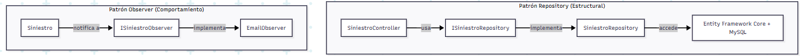

# ADR-05: SiteManager — Integración de Patrones de Diseño GOF

| Campo  | Valor |
|--------|-------|
| Autor  | Ángela Rojas |
| Fecha  | 26/06/2026 |
| Estado | `APROBADO` |

---

## Contexto

SiteManager es una aplicación web para la gestión de siniestros, levantamientos y reparaciones de obra. Conforme el proyecto avanza, se identificaron dos problemas concretos en la arquitectura actual:

1. Los controladores acceden directamente a la base de datos a través de Entity Framework Core, lo que genera un acoplamiento innecesario entre la lógica de negocio y el acceso a datos. Si en el futuro cambia el motor de base de datos o la forma de consultar los datos, habría que modificar los controladores directamente.

2. Cuando un siniestro cambia de estado, el sistema necesita notificar a los involucrados. Sin un mecanismo formal, esa lógica de notificación termina mezclada dentro del controlador, dificultando su mantenimiento y extensión.

Para resolver ambos problemas se decidió integrar dos patrones de diseño GOF de categorías distintas.

---

## Decisión

### Patrón 1 — Repository (Estructural)

Se implementó el patrón Repository para separar la lógica de acceso a datos de los controladores. En lugar de que `SiniestroController` consulte directamente EF Core, ahora delega esa responsabilidad a un Repository.

**Clases involucradas:**

- `ISiniestroRepository` — interfaz que define las operaciones disponibles
- `SiniestroRepository` — implementación concreta que usa EF Core y MySQL

**¿Por qué?** El controlador ya no necesita saber cómo se obtienen los datos, solo sabe que puede pedírselos al Repository. Esto hace que el código sea más limpio, más fácil de probar y más fácil de modificar si en el futuro cambia la fuente de datos.

---

### Patrón 2 — Observer (Comportamiento)

Se implementó el patrón Observer para manejar las notificaciones cuando un siniestro cambia de estado. El objeto `Siniestro` notifica automáticamente a todos sus observers registrados cuando ocurre un cambio relevante.

**Clases involucradas:**

- `ISiniestroObserver` — interfaz con el método `Notificar`
- `EmailObserver` — implementación que envía un correo cuando se activa la notificación
- `Siniestro` — clase que mantiene una lista de observers y los notifica al cambiar de estado

**¿Por qué?** La lógica de notificación queda completamente separada del siniestro. Si en el futuro se necesita agregar otro tipo de notificación, como un SMS o un log, solo se crea un nuevo observer sin tocar la clase `Siniestro`.

---

## Alternativas consideradas

| Alternativa | Por qué la descarté |
|---|---|
| **Singleton (Creacional)** | Aunque es útil para garantizar una sola instancia de un objeto, no resuelve ninguno de los problemas concretos identificados en SiteManager en esta etapa. |
| **Factory Method (Creacional)** | Útil para crear objetos de forma flexible, pero el sistema aún no tiene suficiente variedad de tipos de siniestros o reportes que justifiquen su uso en este momento. |
| **Decorator (Estructural)** | Permite agregar comportamiento a objetos de forma dinámica, pero agrega complejidad innecesaria para lo que el sistema necesita ahorita. |

---

## Consecuencias

**✅ Lo que gano:**

- **Técnico:** El patrón Repository desacopla los controladores de EF Core, haciendo que el código sea más limpio y fácil de mantener. El patrón Observer desacopla la lógica de notificación del siniestro, permitiendo agregar nuevos tipos de notificación sin modificar lo que ya existe.

- **Escalabilidad:** Ambos patrones hacen que el sistema sea más fácil de extender. Agregar un nuevo repositorio o un nuevo observer es una operación que no afecta el resto del sistema.

**⚠️ Lo que sacrifico o asumo:**

- **Complejidad adicional:** Agregar estas capas de abstracción implica más clases e interfaces en el proyecto. Para un sistema pequeño esto puede sentirse como sobrecarga, pero es una inversión que se justifica conforme el sistema crece.

- **Curva de aprendizaje:** Ambos patrones requieren entender bien las interfaces y la inyección de dependencias en ASP.NET Core para implementarse correctamente.

---

## Diagrama

---

## Cláusula de IA

Para la elaboración de este documento se utilizó inteligencia artificial (Claude, de Anthropic) como herramienta de apoyo en las siguientes tareas:

- Sugerencia y justificación de los patrones GOF más adecuados para SiteManager
- Apoyo en la redacción y estructuración del ADR-05
- Generación del código Mermaid para el diagrama de patrones
- Argumentación de las alternativas descartadas con base en el contexto del proyecto

Todo el contenido fue revisado y validado por la autora para asegurar que refleja correctamente las decisiones y el contexto real de SiteManager.