# ADR-09: Entrega — Recopilación de la evolución de SiteManager

| Campo | Valor |
|---|---|
| Autora | Ángela Rojas |
| Fecha | 01/08/2026 |
| Proyecto | SiteManager — Gestión de siniestros y reparaciones de obra |
| Ubicación de los ADR individuales | `SiteManager.Web/Documentation/` |

---

## 📖 Propósito de este documento

SiteManager acumuló, a lo largo del cuatrimestre, ocho decisiones
arquitectónicas formales documentadas como ADR. Cada una resolvió un
problema concreto en el momento en que se tomó, y muchas de ellas
construyen directamente sobre la decisión anterior.

Este documento existe para dar una **vista panorámica y cronológica** de
esa evolución — sin reemplazar los ADR individuales, sino conectándolos
entre sí para que se entienda el hilo narrativo completo: de un proyecto
MVC simple con MySQL, a un sistema en capas, con API REST, patrones de
diseño, pruebas automatizadas y una base de datos PostgreSQL real.

> [!NOTE]
> Cada sección de este documento resume una decisión — el detalle
> completo, las alternativas consideradas y las consecuencias analizadas
> viven en el ADR individual correspondiente, enlazado en cada sección.

---

## 🗺️ Línea de tiempo de decisiones

```mermaid
flowchart LR
    A["📐 ADR-01<br/>MVC + MySQL"] --> B["🧩 ADR-02<br/>Vistas 4+1"]
    B --> C["🏛️ ADR-03<br/>Arquitectura en Capas"]
    C --> D["🌐 ADR-04<br/>+ API REST"]
    D --> E["🧱 ADR-05<br/>Repository + Observer"]
    E --> F["⚠️ ADR-06<br/>Deuda técnica"]
    F --> G["✅ ADR-07<br/>xUnit + CI"]
    G --> H["🐘 ADR-08<br/>JSON → PostgreSQL"]

    style A fill:#dbeafe,stroke:#3b82f6
    style B fill:#dbeafe,stroke:#3b82f6
    style C fill:#e0e7ff,stroke:#6366f1
    style D fill:#dcfce7,stroke:#22c55e
    style E fill:#fef9c3,stroke:#eab308
    style F fill:#fee2e2,stroke:#ef4444
    style G fill:#dcfce7,stroke:#22c55e
    style H fill:#cffafe,stroke:#06b6d4
```

---

## 📐 ADR-01 — Estructura del proyecto

### 🎯 Qué se decidió

El punto de partida de SiteManager. Se eligió el patrón **MVC
(Model-View-Controller)** como estructura principal, sobre **ASP.NET
Core + C#**, con **MySQL** como motor de base de datos relacional y
**Entity Framework Core** como ORM para conectar las clases del dominio
con las tablas de la base de datos.

### 💭 Por qué importa

Esta decisión definió el stack tecnológico completo del proyecto desde el
primer día: el lenguaje, el framework web, el motor de persistencia y la
forma de mapear objetos a tablas. Todas las decisiones posteriores (capas,
API, patrones de diseño) se construyen encima de esta base, sin
contradecirla.

### ❌ Alternativas descartadas

| Alternativa | Motivo de descarte |
|---|---|
| Java + Spring Boot | Requiere más configuración inicial; el curso ya trabaja en C# |
| PostgreSQL | Configuración más compleja para un proyecto individual pequeño |
| Microservicios | Complejidad innecesaria para el alcance del proyecto |

📄 [`ADR-01-Angela-Rojas.md`](./ADR-01-Angela-Rojas.md)

---

## 🧩 ADR-02 — Vistas Arquitectónicas (Modelo 4+1)

### 🎯 Qué se decidió

Se documentó SiteManager bajo el **Modelo de Vistas 4+1**, describiendo
el sistema desde cuatro ángulos complementarios:

| Vista | Qué describe en SiteManager |
|---|---|
| 🧠 **Lógica** | Los 5 módulos funcionales: Siniestros, Clientes, Evidencias, Cotizaciones, Usuarios |
| 🛠️ **Desarrollo** | La organización de carpetas del proyecto MVC (`Controllers/`, `Models/`, `Views/`, `Data/`) |
| ⚙️ **Procesos** | El flujo completo del registro de un siniestro nuevo, desde la petición HTTP hasta la notificación por correo |
| 🚀 **Despliegue** | El entorno local de desarrollo, con la aplicación y MySQL corriendo en la misma máquina |

### 💭 Por qué importa

Este ADR no introduce tecnología nueva — su valor está en dar
**visibilidad completa** de cómo encajan todas las piezas del sistema
entre sí, algo especialmente valioso en un proyecto individual donde no
hay otro desarrollador con quien discutir el diseño en voz alta.

📄 [`ADR-02-Angela-Rojas.md`](./ADR-02-Angela-Rojas.md)

---

## 🏛️ ADR-03 — Estilo Arquitectónico: Arquitectura en Capas

### 🎯 Qué se decidió

Se formalizó la **Arquitectura en Capas** como el estilo arquitectónico
oficial de SiteManager, reconociendo y nombrando una estructura que el
sistema ya tenía de forma natural desde el ADR-01:

| Capa | Responsabilidad |
|---|---|
| 🖥️ Presentation | Razor Pages — interfaz de usuario |
| 🧮 Application | Controladores — lógica de negocio |
| 📦 Domain | Modelos C# — entidades y reglas |
| 🗄️ Infrastructure | Entity Framework Core + MySQL — acceso a datos |

### 💭 Por qué importa

Esta decisión es la que hace posible, más adelante, que agregar la API
REST (ADR-04) o cambiar el motor de persistencia (ADR-08) no requiera
reescribir el sistema completo — cada capa puede cambiar sin que las
demás se enteren.

### ❌ Alternativas descartadas

Microservicios, Arquitectura Hexagonal, Event-Driven y Serverless — todas
descartadas por agregar complejidad de configuración y despliegue que no
se justifica para un proyecto individual que corre en entorno local.

📄 [`ADR-03-Angela-Rojas.md`](./ADR-03-Angela-Rojas.md)

---

## 🌐 ADR-04 — Incorporación de API REST

### 🎯 Qué se decidió

Se agregó una **API REST** (ASP.NET Core Web API) para el módulo de
Siniestros, exponiendo operaciones CRUD completas documentadas
automáticamente vía **Swagger**:

| Método | Ruta | Función |
|---|---|---|
| `GET` | `/api/siniestros` | Listar todos los siniestros |
| `GET` | `/api/siniestros/{id}` | Consultar uno específico |
| `POST` | `/api/siniestros` | Crear uno nuevo |
| `PUT` | `/api/siniestros/{id}` | Actualizar uno existente |
| `DELETE` | `/api/siniestros/{id}` | Eliminar uno existente |

### 💭 Por qué importa

Gracias a la Arquitectura en Capas del ADR-03, esta nueva puerta de
entrada **no duplica lógica**: tanto Razor Pages como la API comparten el
mismo Domain y el mismo Infrastructure — solo cambia el formato de salida
(HTML vs JSON).

📄 [`ADR-04-Angela-Rojas.md`](./ADR-04-Angela-Rojas.md)

---

## 🧱 ADR-05 — Patrones de Diseño GOF: Repository y Observer

### 🎯 Qué se decidió

Se integraron dos patrones de diseño GOF de categorías distintas, cada
uno resolviendo un problema concreto detectado en el sistema:

| Patrón | Categoría | Problema que resuelve |
|---|---|---|
| 🗃️ **Repository** | Estructural | Los controladores accedían directamente a EF Core, acoplando lógica de negocio con acceso a datos |
| 👁️ **Observer** | Comportamiento | La lógica de notificación de cambios de estado vivía mezclada dentro del controlador |

### 💭 Por qué importa

Este es, en retrospectiva, uno de los ADR más importantes del proyecto:
la decisión de introducir el patrón Repository aquí es la razón directa
por la que, dos meses después, la migración completa de JSON a
PostgreSQL (ADR-08) fue posible sin tocar un solo controlador. Este punto
se analiza a fondo en el documento de **Evaluación ATAM** como punto de
sensibilidad.

📄 [`ADR-05-Angela-Rojas.md`](./ADR-05-Angela-Rojas.md)

---

## ⚠️ ADR-06 — Deuda Técnica Identificada

### 🎯 Qué se decidió

Se documentaron formalmente tres deudas técnicas reales, reconociendo
partes del sistema que funcionaban pero no de forma sostenible:

| # | Deuda | Solución propuesta |
|---|---|---|
| 1️⃣ | Ruta de almacenamiento de datos fija en el código (`Program.cs`) | Moverla a `appsettings.json` |
| 2️⃣ | `EmailObserver` no envía notificaciones reales, solo imprime en consola | Conectar un servicio real de correo (SMTP/SendGrid) |
| 3️⃣ | Almacenamiento en archivos JSON en lugar de una base de datos real | Migrar a PostgreSQL con EF Core (ejecutado en el ADR-08) |

> [!IMPORTANT]
> La transición de MySQL (definido en el ADR-01) a JSON como
> almacenamiento temporal ocurrió en algún punto entre el ADR-05 y este
> ADR-06, pero **no quedó documentada formalmente en un ADR propio en su
> momento**. Se reconoce y se documenta de forma retroactiva aquí, como
> parte de esta misma deuda técnica, en lugar de dejarla sin registro.

### 💭 Por qué importa

Documentar deuda técnica no es admitir un fracaso — es una práctica de
madurez arquitectónica: deja claro qué se sabe que falta, por qué existe,
y qué se necesitaría para resolverlo, en lugar de dejar que quede oculto
hasta que cause un problema real.

📄 [`ADR-06-Angela-Rojas.md`](./ADR-06-Angela-Rojas.md)

---

## ✅ ADR-07 — Suite de Pruebas xUnit y Pipeline CI

### 🎯 Qué se decidió

Se incorporó una suite de **pruebas unitarias con xUnit** y un
**pipeline de Integración Continua (CI)** mediante GitHub Actions, que
ejecuta las pruebas automáticamente en cada `push` al repositorio.

### 💭 Por qué importa

Este ADR llega justo antes de la migración de base de datos más
riesgosa del proyecto (ADR-08) — no es casualidad. Tener pruebas
automatizadas corriendo en cada cambio da una red de seguridad real antes
de tocar algo tan sensible como el mecanismo de persistencia completo del
sistema.

📄 [`ADR-07-Angela-Rojas.md`](./ADR-07-Angela-Rojas.md)

---

## 🐘 ADR-08 — Migración de JSON a PostgreSQL con EF Core

### 🎯 Qué se decidió

Se resolvió formalmente la Deuda Técnica 3 del ADR-06: se migró el
almacenamiento completo de archivos JSON a **PostgreSQL**, usando
**Entity Framework Core** y el proveedor **Npgsql**. Se implementaron
siete repositorios `Ef*Repository`, uno por cada entidad del sistema
(Cliente, Siniestro, Evidencia, Cotización, Material, Reporte, Usuario),
con sus relaciones y reglas de eliminación (`CASCADE`, `RESTRICT`,
`SET NULL`) correctamente definidas.

### 💭 Por qué importa

Este ADR es la validación empírica del ADR-05: gracias a que el patrón
Repository ya desacoplaba el acceso a datos, la migración completa se
logró **cambiando únicamente el registro de dependencias en
`Program.cs`**, sin tocar controladores, servicios ni modelos. También
se definió, como parte de este mismo ADR, cómo se almacenarían las
imágenes del módulo de Evidencias — decisión analizada a fondo como
trade-off en el documento de Evaluación ATAM.

📄 [`ADR-08-Angela-Rojas.md`](./ADR-08-Angela-Rojas.md)

---

## 📊 Estado final de la arquitectura

| Aspecto | Estado final |
|---|---|
| 🏛️ Estilo arquitectónico | Arquitectura en Capas |
| 🚪 Entradas al sistema | Razor Pages (Web) + API REST (Api) |
| 🧱 Patrones GOF aplicados | Repository, Observer |
| 🗄️ Persistencia | PostgreSQL vía Entity Framework Core |
| 🖼️ Almacenamiento de archivos | Sistema de archivos local |
| ✅ Pruebas | xUnit + Pipeline CI (GitHub Actions) |
| ⚠️ Deuda técnica pendiente | Notificaciones aún no envían correos reales (ADR-06, Deuda 2) |

---

## 🤖 Cláusula de IA

Para la elaboración de este documento se utilizó inteligencia artificial
(Claude, de Anthropic) como herramienta de apoyo en la consolidación,
organización cronológica y redacción descriptiva del resumen de las
decisiones ya documentadas individualmente en cada ADR. Todo el
contenido fue revisado y validado por la autora para asegurar que
refleja correctamente la evolución real del proyecto SiteManager.