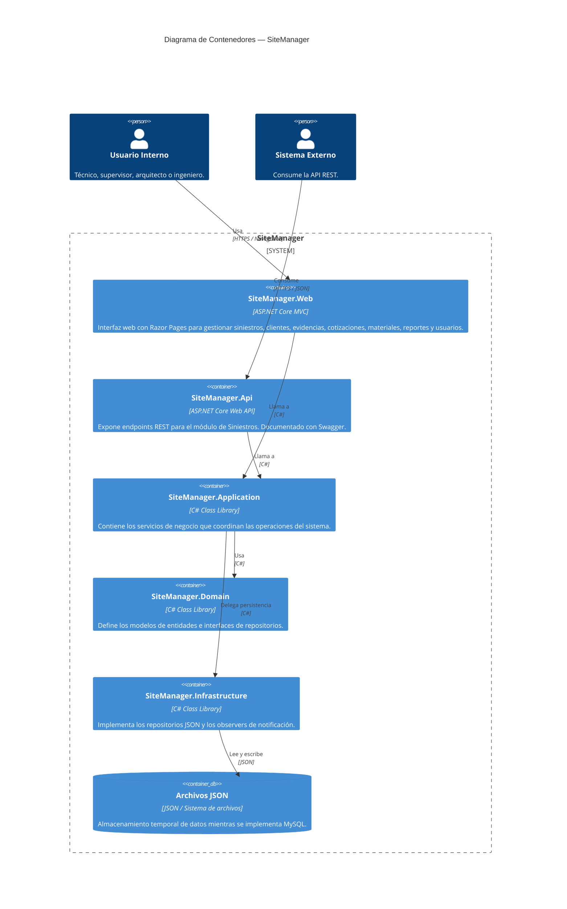

## Nivel 2 — Contenedores

**¿Para quién es este diagrama?** Para desarrolladores y arquitectos que necesitan entender las piezas técnicas grandes del sistema.

**¿Qué muestra este diagrama?** Las piezas técnicas principales que conforman SiteManager y cómo se comunican entre sí, es decir las capas implementadas en su arquitectura. Aquí ya aparecen tecnologías concretas como ASP.NET Core, pero sin entrar en detalles de clases o métodos internos.

